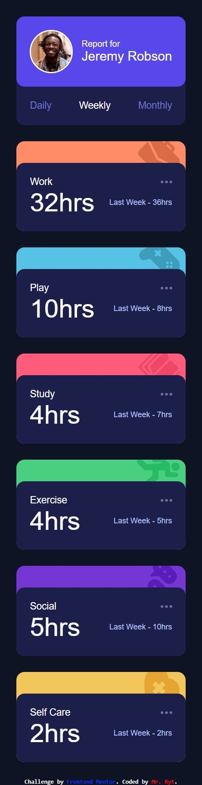

# Frontend Mentor - Time tracking dashboard solution

This is a solution to the [Time tracking dashboard challenge on Frontend Mentor](https://www.frontendmentor.io/challenges/time-tracking-dashboard-UIQ7167Jw). Frontend Mentor challenges help you improve your coding skills by building realistic projects.

## Table of contents

- [Overview](#overview)
  - [The challenge](#the-challenge)
  - [Screenshot](#screenshot)
  - [Links](#links)
- [My process](#my-process)
  - [Built with](#built-with)
  - [What I learned](#what-i-learned)
  - [Continued development](#continued-development)
  - [Useful resources](#useful-resources)
- [Author](#author)
- [Acknowledgments](#acknowledgments)

## Overview

### The challenge

Users should be able to:

- View the optimal layout for the site depending on their device's screen size
- See hover states for all interactive elements on the page
- Switch between viewing Daily, Weekly, and Monthly stats

### Screenshot




### Links

- Solution URL: [https://github.com/MrRyt247/time-tracking-dashboard_fm.git](https://github.com/MrRyt247/time-tracking-dashboard_fm.git)
- Live Site URL: [https://mrryt247.github.io/time-tracking-dashboard_fm/](https://mrryt247.github.io/time-tracking-dashboard_fm/)

## My process

### Built with

- Semantic HTML5 markup
- CSS custom properties
- Flexbox
- CSS Grid
- jQuery

### What I learned

- I learnt how to write async calls in jQuery. This is the best readable syntax I found out there!

```js
$.ajax({
  url: "https://example.com",
  method: "GET",
  dataType: "json",
})
  .done((data) => {
    // Success
    next(data);
  })
  .fail((error) => {
    // Fail
    console.log("Error:", error);
  });
```

- I also refined my knowledge in DOM traversal.

### Continued development

- jQuery

### Useful resources

- [W3 Schools jQuery Traversing](https://www.w3schools.com/jquery/jquery_traversing_siblings.asp) - This helped me in knowing the appropriate methods for DOM traversal with jQuery

## Author

- Frontend Mentor - [@MrRyt247](https://www.frontendmentor.io/profile/MrRyt247)
- X - [@MrRyt19](https://www.twitter.com/MrRyt19)
- IG - [@MrRyt247](https://www.instagram.com/mrryt247)

## Acknowledgments

- w3schools
- Claude AI 3.5 Haiku
